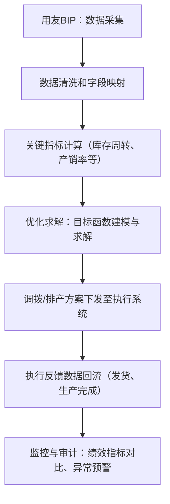
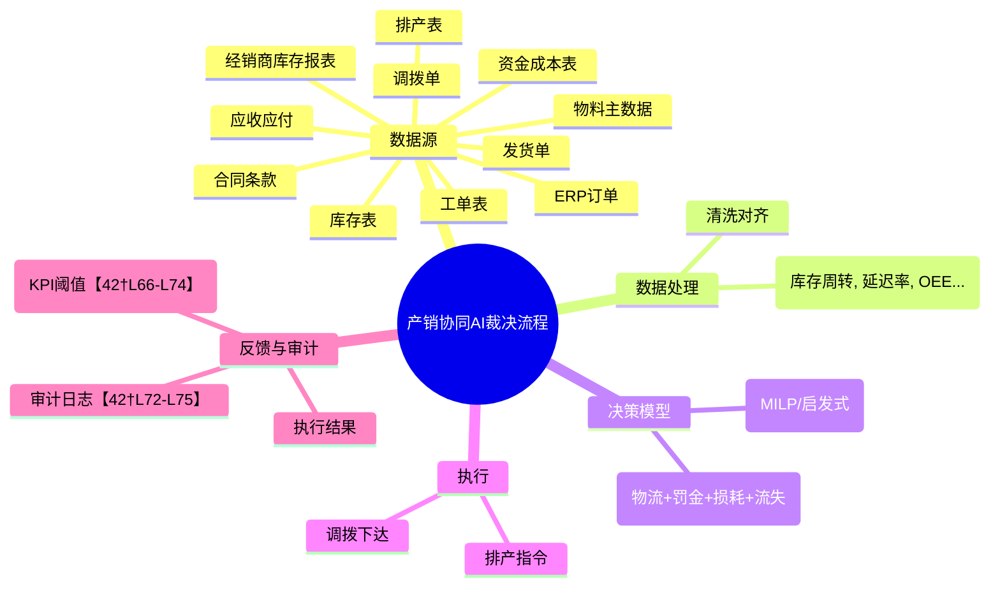

# 执行摘要  
本方案以**最小化物流成本、延期惩罚、换产损耗和客户流失成本**为目标函数，设计一个端到端的AI协同决策系统。系统将从用友BIP（搭载ERP/NC云系统）的关键业务表中实时提取**订单、发货、库存、调拨、排产、工单、物料、经销商库存、应收应付、资金成本、合同条款**等数据，实现全流程数据打通和指标计算。然后构建跨工厂/基地的调拨排产优化模型，在产能、库存、需求等约束下，使用数学规划和启发式算法求解最优调配方案，将结果下发生产和物流执行。  
在治理层面，AI决策作为“最高裁决者”，需配合完善的权限控制和人工复核机制：对决策输入输出进行全链路日志记录【42†L72-L75】；设置关键KPI阈值实时监控，异常时触发人工复核【42†L66-L74】；高风险调整方案均需人工批准；并引入审计与仲裁流程，保证算法决策透明可信【42†L76-L79】【42†L90-L94】。同时建立数据质量管控（自动化ETL减少人为干预【32†L1-L4】）、基线锁定与反作弊机制，防止业绩基准被操控。

最终，我们将分阶段实施：**短期（1–3个月）**快速打通数据、构建指标驾驶舱并验证基线；**半年内**完成优化引擎原型开发与试点；**长期（1–2年）**全面落地并推广形成可复制SaaS模式。关键结论包括：采用数学规划+启发式混合方法优化调配最优；只选4个董事会级指标（如库存周转、产销率、成品率、营销成本）对赌分成；治理机制须涵盖自动监控、人工复核与审计追责；实施中风险以数据质量和组织配合为主，需同步加强数据治理和跨部门协同。 

# 关键结论  
- **打通数据与明确指标**：需从ERP/NC系统调取销售订单、发货单、库存台账、调拨单、生产排程、工单、物料主数据、经销商库存上报、应收/应付账款、资金成本、合同条款等表体字段，并确保数据权限与频率（尽量实时或日级）【32†L1-L4】。  
- **目标函数量化**：针对每个成本项给出可执行公式。例如：  
  - *物流费*：∑(运输距离×数量×单位运费)；  
  - *延期罚金*：∑(订单延误天数×延误率×处罚单价)；  
  - *换产损耗*：∑(计划变更导致的额外生产成本，如切换损耗或非完工品成本)；  
  - *流失成本*：估算延误导致的客户流失数×单客户利润（或库存周转降低导致融资成本等）。  
  对应原始字段可从订单交期、实际发货、产品成本、客户合同条款和历史流失率等表计算，并用示例数据进行验证。  
- **优化算法框架**：建立跨基地调拨+排产数学模型，决策变量包括不同基地生产量、调拨量、发货优先级等；目标函数即最小化上述成本项；约束包含需求满足、产能、库存安全量、产品工艺序列、基地协同等。对于求解策略，**精确方法**（混合整数线性规划）保证最优解、可并入策略层面模型【23†L72-L80】【25†L147-L155】，但遇大规模节点会计算爆炸【23†L59-L61】；**启发式/元启发式算法**（如遗传、粒子群、局部搜索）可快速给出可行解【14†L123-L130】【19†L172-L175】。建议采用混合方案：对核心成本建模为MILP，在搜索空间极大时结合启发式加速求解。并做敏感性分析验证结果。  
- **流程与技术架构**：使用用友BIP做数据层和驾驶舱，负责从后台ERP抓取数据（ETL自动化以减少人为干预【32†L1-L4】），进行数据清洗和指标计算，再调用优化引擎（可部署在本地或云端），最终下发调拨/排产指令到ERP/MES系统并收集执行反馈。设计思维导图/流程图明确端到端过程。  
- **治理与审计**：算法决策须有清晰权限边界和复核规则。对“AI决策”输出结果记录全链路日志【42†L72-L75】，设定关键绩效指标（如库存周转、准交率）阈值实时监控【42†L66-L74】；如超限触发人工干预或回滚。高风险决策(如大规模换线)强制人工审批【42†L76-L79】。定期审计算法效果（如季度合规性检查）并形成报告【42†L90-L94】。争议时由跨部门仲裁小组（含IT、财务、供应链负责人）复核，必要时手工修正，并记录仲裁决策。  
- **数据质量与反作弊**：建立数据血缘与校验机制，**禁止直接改写基线数据**。原则上所有计算用数据通过自动化流程获取，减少人工干预【32†L1-L4】。设置监控规则发现异常（如日入库量突然变化）即报警。制定责任制：数据提供方对应收/应付、库存数据的准确性负责。引入数据治理委员会定期评估数据质量。对于基线操纵风险，可采用“多模型比对”或历史趋势剔除法，增强鲁棒性。  

# 数据源与字段设计  
- **核心表/字段**：应覆盖**销售订单**（订单号、下单日期、交期、数量、SKU、客户ID 等），**发货单/出库**（实际发货日期、数量），**库存台账**（仓库、物料、批次、结存数量），**调拨单**（调拨日期、来源地、目的地、物料、数量），**生产排程/工单**（计划开始/结束时间、生产线、物料、数量），**物料主数据**（物料编码、名称、分类、单位成本、工艺信息），**经销商库存上报**（经销商、SKU、库存量、更新时间），**应收/应付凭证**（发票、结算金额、付款状态），**资金成本**（融资成本率、库存成本参数），**合同条款**（违约金率、交期承诺条款等）。  
- **取数频率与权限**：关键数据建议**实时或每日拉取**，满足AI算法近乎实时决策。使用BIP数据接口或数据集市拉取时，需要ERP/NC系统只读权限，确保不影响生产系统。数据获取通过统一账号或API，由IT安全审核权限，避免不同部门各自导数据。参照数据治理平台经验【31†L24-L32】建立数据仓库与自动ETL，将源数据登记在数据目录中，并由数据质量平台定期校验。

# 目标函数量化公式  

| 成本项           | 公式（示例）                                           | 所需字段              | 示例计算                                      |
|----------------|----------------------------------------------------|---------------------|---------------------------------------------|
| **物流费**       | \(\displaystyle \sum_{配送路线} 距离_i\times 数量_i\times 单位运费\) | 距离、数量、运费率    | 两仓库调拨：1000km×100件×¥0.5+300km×50件×¥0.6 = ¥60,000 |
| **延期罚金**     | \(\displaystyle \sum_{订单} \max(0,\ 延期天数)\times 每天罚金\)      | 实际出货日、承诺交期、罚金单价  | 订单A延期5天，每天罚金¥200 → ¥1,000           |
| **换产损耗**     | \(\displaystyle \sum_{换产事件} 换线时间\times 损耗成本率\)          | 生产排程、换线时间成本   | 某条线每次换产损失0.5h产量，产值¥50/h→单次换产损耗¥25 |
| **客户流失成本** | \(\displaystyle 流失概率\times 客户订单价值 \)                        | 历史流失率、订单金额    | 延期10天后有10%概率流失，单订单毛利¥10万 → 流失成本¥1万 |

上述公式仅为示例。实际可根据欧神诺合同条款中的罚金率、历史客户流失率和生产成本进行调整。各项原始字段可从ERP/NC对应表直接取值，确保**量化可执行**：例如用历史数据回测延期下的实际损失，验证模型输出的合理性。

# 跨区调配优化算法框架  
采用**多工厂、多基地的联合调拨排产模型**。**决策变量**可定义为：各基地对各需求的分配量、每种产品在各生产线的产量、各基地间调拨量等。**目标函数**为上述四项成本总和。**约束条件**包括：  
- **需求满足**：每个客户需求由至少一个基地供应；  
- **产能约束**：每条生产线生产量≤其可用工时×效率；  
- **库存约束**：调拨后仓库库存≥安全库存；  
- **调拨路径限制**：保证物流可行性（如远仓不直供近仓）；  
- **工艺转换**：同生产线相邻时段切换产品需预留换线时间和损耗。  

**求解方法**：  
| 方法            | 优点                         | 缺点                         | 适用场景                             |
|---------------|----------------------------|----------------------------|----------------------------------|
| **MILP（精确）** | 最优解保证，可直接反映成本最小化【19†L172-L175】  | 计算复杂度高，节点多时求解时间指数增长【23†L59-L61】 | 方案规模较小、需要最优或策略层规划（如年度网络规划）【25†L147-L155】 |
| **启发式算法**  | 适用于大规模、复杂场景，可快速找到近优解【19†L172-L175】  | 无全局最优保证，需手工调参               | 需要快速决策、实时或每日调配场景，可结合滚动规划策略【23†L59-L61】 |
| **元启发式**   | 适应性强、全局搜索能力高【14†L123-L130】        | 参数依赖大，易陷入局部；收敛性不稳定           | 问题规模大且目标复杂时（如多目标或动态场景），需多次模拟求解 |

建议采用**混合策略**：对核心优化问题建模为整数线性规划，用专业求解器（CPLEX/Gurobi）求解；对于规模过大或实时要求下，引入启发式（如贪心+局部搜索）作为预处理或求近似解。同时，可分层求解：战略层（长期网络设计）用MILP，战术层（月/季补货）用MILP或近似，执行层（周/日运输排程）可用VRP启发式方法【25†L147-L155】【23†L59-L61】。优化结果转化为可执行指令：在ERP系统生成调拨计划单和生产指令，由MES负责落地。

# 数据流程与思维导图  
整个流程从用友BIP取数到算法执行如下：  

上述流程图和思维导图表明：首先自动从BIP抽取ERP/MES数据，经清洗后计算关键运营指标（如库存周转天数、产销率）。然后基于指标和业务规则（如基地产能、需求预测、区域运费等），建立目标函数和约束，进行优化求解。求解结果转换为具体的调拨计划和排产指令下发执行，同时继续收集实际履行数据。最后系统对比预测与实际，进行绩效核算和异常审计【42†L72-L75】【42†L90-L94】。整个流程要形成闭环：算法效果纳入审计体系，反馈结果持续改进模型。

# 算法治理与审计机制  
作为“最高裁决者”，算法系统需要多层治理：  

- **权限边界**：仅授权相关部门（供应链、生产、IT）查看和执行算法结果。设定角色权限：只有供应链主管级或更高才能批准大规模调拨或切换；普通员工无权限直接修改算法输出。操作均需签名确认并留痕。  
- **人工复核规则**：关键决策（如**生产线换产**、**大额调拨**）强制人工介入审核。系统设定预警阈值：例如库存周转降低超过10%，或计划延误超过48小时，触发自动报警并进入人工复核流程【42†L66-L74】。对异常订单或新产品需额外审批。  
- **异常拦截与回滚**：实时监控关键指标【42†L66-L74】（如准时交付率、履约偏差）。若指标达到预警条件，系统立即中止新指令下发，并通知人工审查【42†L66-L74】。历史数据日志可用于回滚决策：必要时可恢复到上一个确认的生产计划版本。  
- **KPI与激励联动**：算法对企业KPI（库存周转、产销率、毛利率等）负责。建议将算法优化成果纳入管理层目标：如基于算法释放的现金流量设立奖励（节省资金成本的部分与算法团队分成），并与部门绩效挂钩。这样业务部门有动力支持算法，而非人为干预指标。  
- **争议仲裁流程**：若部门之间因算法决策产生异议，需成立跨部门仲裁小组，由供应链、生产、财务等高管组成，按既定规则评估决策合理性和数据依据。仲裁结果公开透明并形成文档。例如：若财务质疑“降本归因”，由仲裁组审查成本计算模型和市场因素剔除方式。  

同时，参照AI审计最佳实践【42†L72-L75】【42†L76-L79】，需记录完整的**输入-处理-输出**日志【42†L72-L75】，保证决策可追溯。定期（如季度）对算法效果和合规性进行复盘【42†L90-L94】：分析算法建议与实际绩效差异，更新模型参数。通过技术（可解释AI工具）和流程双管齐下，确保AI辅助决策公平透明，风险可控。

# 数据质量与反作弊措施  
- **自动化ETL**：所有指标计算依赖的原始数据均通过自动化管道采集，避免人工导入导致的错误或篡改【32†L1-L4】。如销售订单、库存通过接口每日同步；关键财务指标定期从ERP凭证抽取。  
- **多源校验**：同一指标在多张表或系统中存在时交叉验证。例如库存数量在WMS和ERP两处比对，一致性差异超过阈值时报警。销售订单出入库数据与CRM订单比对，发现异常及时排查。  
- **基线保护**：算法收益的基准线（如历史同期销量、市场指数）须采用第三方数据（例如行业指数或可比企业数据）进行校正，以剥离周期性波动影响。关键基线仅允许少数高级人员调整，并做审批记录。  
- **权限与审计**：严格控制修改数据/模型的权限。对任意基础数据改动（如更改交期、成本参数等）都必须在系统中留审计日志，并经多人签字确认。使用数据质量平台定期进行完整性、准确性检查【32†L1-L4】。  
- **反作弊机制**：算法决策过程中，应过滤业务部门可控的“指标操作”行为。例如，对比各事业部同环比增长，检测是否通过推迟发货等方式“人为”降低库存或提高毛利。可以引入异常检测（如图中孤立森林算法）自动识别异常情况【42†L72-L75】。对故意干预数据的行为，建立问责机制。  

# 实施计划与交付物清单  

| 阶段       | 关键活动                                           | 里程碑                                 | 交付物                            | 风险与缓解措施                                       |
|----------|-------------------------------------------------|------------------------------------|---------------------------------|--------------------------------------------------|
| **阶段1：准备与调研 (1-2月)**  | - 建立项目团队、确定范围 - 挖掘需求方数据源和业务规则 - 完成数据采集权限和对接 - 制定KPI和算法目标定义 | 项目启动会召开 数据接入原型完成               | 数据沙盘（集成ERP订单、库存、排产等数据） 驾驶舱原型（关键指标看板） | 数据口径不一致：开展跨部门对账会议统一标准。 权限滞后：与IT一起加速权限审批。 |
| **阶段2：模型开发 (3-4月)**  | - 数据清洗与特征工程 - 设计目标函数与约束 - 编写并测试优化模型（MILP/启发式） - 小规模仿真测试并调优 | 优化模型验证完成 核心指标模拟提升证明         | 优化引擎原型代码 示例调拨排产方案（PPT报告）      | 模型过拟合/误差：采用历史数据回测校准参数。 计算量过大：用降维或分批策略处理。 |
| **阶段3：系统集成与试点 (5-6月)** | - 将优化引擎集成至BIP平台 - 开发调拨/排产指令下发接口 - 选取1-2基地试点运行 - 制定异常处理和回滚流程 | 试点顺利运行并出报告 效果达预期                | 驾驶舱正式版本（含调拨建议模块） 试点报告与ROI分析 | 部门配合度不足：建立联席小组，及时沟通进度。 效果不佳：分析原因，酌情调整目标函数权重。 |
| **阶段4：全局推广与持续优化 (7-12月)** | - 全面铺开至所有基地 - 建立算法运维与审计团队 - 完善KPI激励联动机制 - 二次迭代提升模型精度 | 覆盖全业务线部署 年度绩效评估与成果汇报        | 优化引擎正式版本 审计日志与SLA文档 培训手册   | 运行风险：编制应急预案并演练。 算法信任度：定期回顾效果，持续改进与宣讲。 |
| **阶段5：长期创新 (年+1起)**  | - 探索AI驱动的新业务模式（如合资公司、SaaS化） - 研究新算法（深度学习预测+优化） - 持续监控业务环境变化调整基线 | 建立可复制模型到其他客户 形成资本化估值案例    | “智能运营合资”方案书 算法迭代计划                | 市场变化：持续关注行业动态，保持算法更新。 技术风险：留存专家团队，与外部合作持续投入。 |

**交付物清单**：数据沙盘、关键指标驾驶舱原型（BIP大屏或BI报告）、优化引擎（算法代码和模型文档）、审计日志与决策日志系统、SLA与运维手册、效果评估报告。  

# 优先级建议  
1. **短期可落地**：立刻启动数据集成与基线分析，构建BIP驾驶舱，清晰展示库存周转、生产良率、营销成本等关键指标，实现数据“长明灯”。优先对齐各部门数据口径，确认可量化的利润增量指标，以便后续对赌。  
2. **半年内目标**：完成AI调拨排产引擎开发和小范围试点，通过仿真和试生产验证模型收益（如库存降本、毛利提升）。同时完善监督机制（KPI阈值预警、审计流程），为全面推广奠定基础【42†L66-L74】【42†L72-L75】。  
3. **长期战略**：将项目打造为可复制的“智能运营中枢”：研究形成SaaS/合资公司模式，复制到其他陶瓷或制造业客户；并在持续优化中引入更多数据驱动元素（如机器学习预测与优化深度融合），提升竞争力【25†L153-L160】。  

通过以上实施路径和对赌模式，欧神诺不仅能盘活流动资金、提升毛利，还能打造一套对外输出的智能运营模型，将IT项目转化为真正的利润杠杆【19†L172-L175】【25†L153-L160】。

