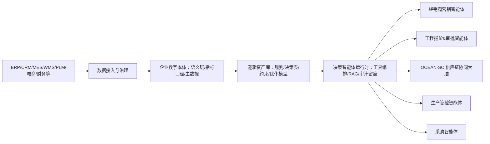
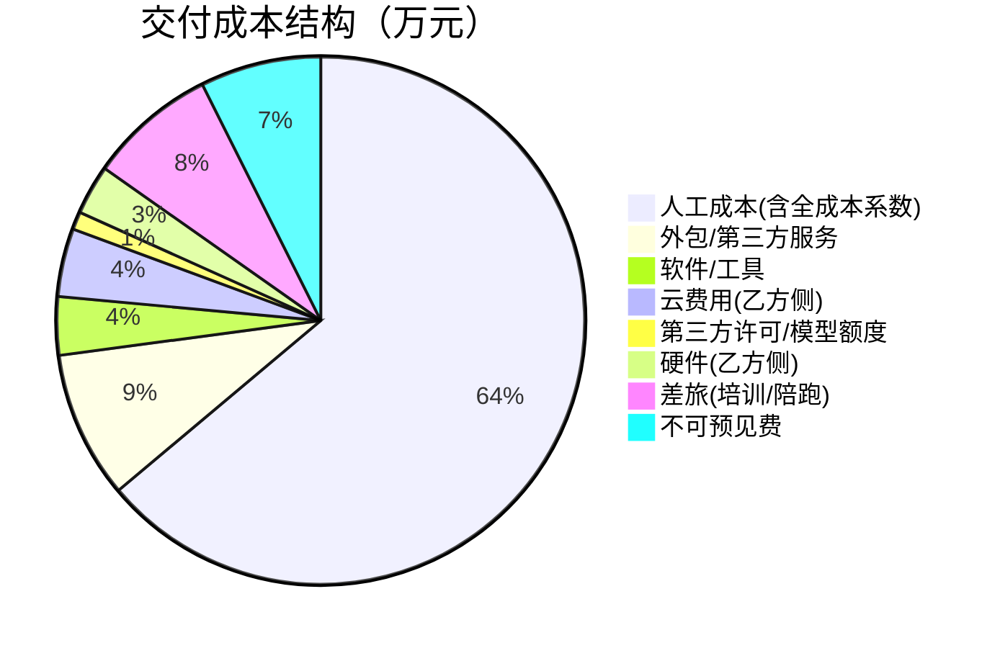
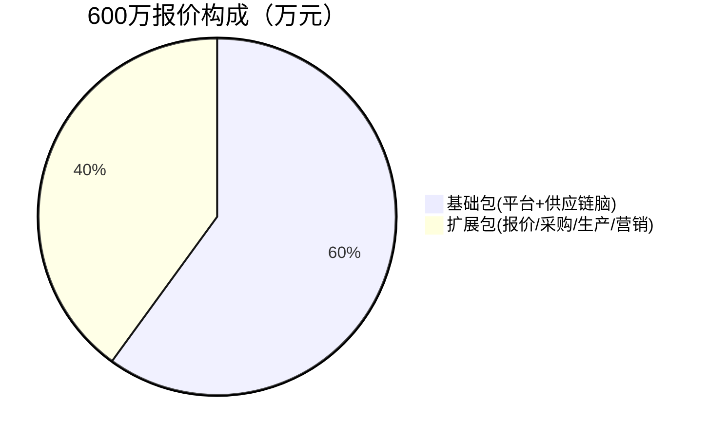
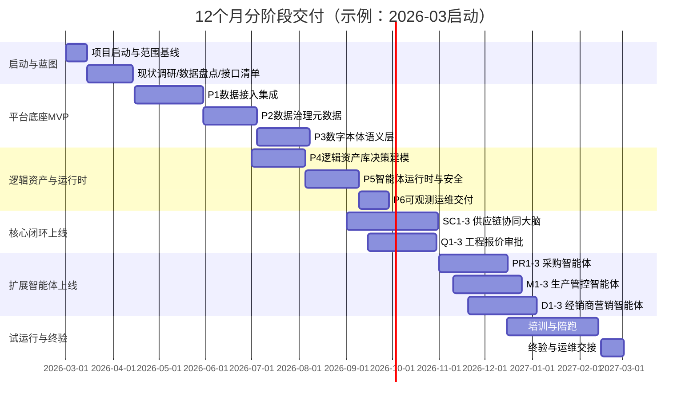

# 从“数据可视化”到“逻辑资产化”：以决策智能体为核心的企业数字本体平台产品化报价包

## 执行摘要
本报告将“五大智能体项目报价”产品化为一套可复制的《企业数字本体平台》报价包：给出模块化功能清单、按角色人天的成本模型并将项目总成本控制在≤250万元，同时提供对外600万元分项定价、12个月里程碑计划、人员配置与利润测算、合同条款与风险清单，可直接用作报价书与合同附件。

## 产品化报价包结构与关键假设

本报价包的核心观点是：企业数字化的“下一跳”不是更炫的看板，而是把可复用的经营逻辑沉淀为“逻辑资产”（规则、决策表、优化模型、指标口径、权限与审计策略），并由可控的智能体去执行、解释与留痕；数据只是输入，决策逻辑才是可规模化复制的资产形态。

这一产品化方向与国内政策与标准趋势一致：  
一方面，数据要素政策强调“乘数效应”和跨场景应用，推动数据开发利用与行业场景落地。citeturn2search3turn2search7  
另一方面，数据价值释放常被概括为“资源化—资产化—资本化”的路径，要求企业把数据与治理能力结合起来形成可交易、可管理的资产与产品。citeturn2search1turn2search5  
同时，entity["organization","财政部","china ministry of finance"]发布的《企业数据资源相关会计处理暂行规定》为企业数据资源的会计确认、披露提供依据，进一步推动“数据资源入表/资产化”在企业侧的规范化实践。citeturn1search0turn1search4

### 报价包的产品结构

“一个底座 + 五个智能体应用”。底座负责把“数据—语义—逻辑—治理”打通，五个智能体在统一底座上按场景交付，避免形成五套割裂系统。底座的建设方法建议对齐国家标准中的数据治理框架与实施过程（规划、实施、评价、改进）。citeturn4search3turn4search11turn4search0

### 关键合规与安全边界假设

本报价包默认在中国境内企业场景落地，因此以个人信息、数据安全、网络数据等合规要求作为合同附件的强制约束：  
个人信息处理遵循《个人信息保护法》的一般原则与处理规则。citeturn5search2  
数据处理活动满足《数据安全法》的基本制度与义务框架。citeturn5search3  
网络数据处理活动与安全监管遵循《网络数据安全管理条例》（国务院令第790号，2025-01-01起施行）。citeturn8search3turn8search22  
信息安全管理体系建议对齐GB/T 22080-2025（2026-01-01实施，替代GB/T 22080-2016）。citeturn8search0turn8search25turn8search10  
系统安全基线可参考网络安全等级保护相关要求（GB/T 22239-2019）。citeturn0search5turn0search1  
数据安全能力建设可参考GB/T 37988-2019（DSMM）。citeturn5search5turn5search1  
个人信息安全实践细则可参考GB/T 35273-2020。citeturn8search1turn0search0

### 可替换参数化假设

以下变量未由你指定，本报告采用“默认值 + 可替换符号”的方式，便于你在不同客户规模下快速重算成本与报价。

| 参数 | 默认值（可替换） | 符号 | 影响点 | 可产品化的“超出计费口径”建议 |
|---|---:|---|---|---|
| 需对接的核心系统数量（ERP/CRM/MES/WMS等） | 4 | N_sys | 接口开发、人天、风险 | >4：按“每新增系统接口包”计费 |
| 站点数（工厂+仓库+分支） | 6 | N_site | 权限、主数据、部署复杂度 | >6：按“每新增站点包”计费 |
| 经销商数量 | 300 | N_dealer | 主数据、营销分群、洞察规模 | >300：按“每100家经销商包”计费 |
| 供应商数量 | 500 | N_supplier | 采购评分、风险模型、主数据 | >500：按“每200家供应商包”计费 |
| 活跃业务用户数（审批/计划/采购/生产/营销） | 200 | N_user | 权限、审计、培训工作量 | >200：按“每50用户包”计费 |
| 数据体量（历史+主数据+日志，TB） | 3TB | V_data | 存储与计算、治理成本 | >3TB：按“每TB存储与治理包”计费 |
| 复用率（乙方已有底座/模板的可复用比例） | 60% | r_reuse | 项目人天与交付成本 | 复用率越低，成本越高；合同中需写明 |

## 五大智能体的产品化模块与功能清单

为实现“报价包可复制”，模块拆分遵循两条原则：  
其一，底座模块以国家数据治理与服务治理相关标准为参考，形成统一的治理与交付框架。citeturn4search3turn4search0turn3search1  
其二，五大智能体以“决策闭环”为最小产品单元（感知→分析→决策→执行/审批→留痕→复盘），避免只做“问答机器人”。

### 共享底座模块（P1–P6）

| 模块ID | 模块名称 | 关键功能清单（产品化可配置） | 主要输出（逻辑资产形态） |
|---|---|---|---|
| P1 | 数据接入与集成 | 标准连接器（API/DB/文件）、增量同步、字段映射、接口监控、接口告警 | 数据接口契约、字段映射表、数据血缘基础 |
| P2 | 数据治理与元数据 | 元数据目录、数据标准、质量规则、主数据（客户/供应商/SKU/组织）、标签与分级 | 数据口径字典、质量规则库、主数据模型 |
| P3 | 企业数字本体（语义层/指标层） | 业务实体关系（订单/库存/产能）、统一指标口径（GMV/缺货率/准交率等）、语义查询 | 语义模型、指标口径表、跨系统一致的“单一事实” |
| P4 | 逻辑资产库与决策建模 | 规则引擎/决策表、约束与红线（毛利/合规）、优化模型注册、场景模拟模板 | 决策表、约束集、优化模型版本库、仿真场景模板 |
| P5 | 决策智能体运行时与安全 | 工具编排、RAG知识库、提示词模板与评测集、审计留痕、敏感信息脱敏与访问控制 | Prompt资产包、工具注册表、审计日志策略、权限矩阵 |
| P6 | 可观测性与运维交付 | 监控告警、日志与追踪、发布流水线、备份恢复、运维手册/应急预案 | 运维SOP、监控指标集、发布与回滚流程 |

其中：运维与服务管理条款建议参考GB/T 28827.1（运维通用要求）、GB/T 24405.1（IT服务管理规范）以及GB/T 28827.7（运维成本度量）。citeturn1search1turn3search1turn3search0turn3search3

### 五大智能体应用模块（按“决策闭环”产品化）

下表给出每个智能体的产品化模块与关键功能，便于后续做“报价书功能附件（标准版/扩展版/可选项）”。

| 智能体 | 模块ID | 产品化模块 | 功能清单（标准版） | 可选增强项（扩展版） | 需要的底座依赖 |
|---|---|---|---|---|---|
| 经销商营销 | D1 | 分群与动销洞察 | 经销商分层、动销/库存结构洞察、异常门店预警 | 地域/客群/价格带精细画像、渠道冲突识别 | P1/P2/P3 |
| 经销商营销 | D2 | 活动建议与素材生成 | 促销方案生成、话术/海报文案模板、门店行动清单 | 多渠道投放联动、素材A/B提醒与复盘 | P3/P5 |
| 经销商营销 | D3 | ROI预测与返利策略模拟 | 促销ROI粗算、返利规则模拟、预算上限红线 | 多变量仿真（价格/供货/竞品）、返利作弊风险规则 | P4/P3 |
| 工程报价&审批 | Q1 | 报价模型与成本拆解 | BOM/工时/材料拆解、报价版本管理、毛利红线 | 历史相似项目检索、自动补全与偏差解释 | P1/P3/P4 |
| 工程报价&审批 | Q2 | 审批流与风控 | 分级审批、授权矩阵、越权/例外留痕、条款审阅辅助 | 合同条款风险评分、合规清单自动核对 | P4/P5/P6 |
| 工程报价&审批 | Q3 | 留痕与报表 | 报价对比、审批时长分析、异常原因归因 | 组织/区域看板、多维度穿透分析 | P3/P6 |
| OCEAN-SC | SC1 | 需求预测与感知 | 需求预测、季节/活动因子、预测偏差诊断 | 需求感知（近实时）、多模型集成与自动切换 | P1/P2/P4 |
| OCEAN-SC | SC2 | 库存与补货优化 | 安全库存建议、补货节奏、缺货/积压预警 | 多级库存优化、服务水平约束优化 | P3/P4 |
| OCEAN-SC | SC3 | 协同与异常闭环 | S&OP例会材料自动生成、异常工单、责任拆解 | 跨组织协同门户（供应商/经销商） | P5/P6 |
| 生产管控 | M1 | 排产与产能决策 | 订单优先级、产能负荷、排产建议 | 有限产能排程、约束求解/启发式优化 | P3/P4 |
| 生产管控 | M2 | 异常处置闭环 | 停机/缺料/质量异常告警、工单流转、原因库 | 设备健康预测/点检建议（需数据） | P1/P5/P6 |
| 生产管控 | M3 | KPI与在制品监控 | 准交率、在制品/瓶颈工序看板、异常追踪 | OEE/能耗/碳数据扩展（视客户数据） | P3/P6 |
| 采购 | PR1 | Spend分析与品类画像 | 采购支出结构、品类树、价格波动监控 | 预算+需求联动（MRP/计划） | P1/P3 |
| 采购 | PR2 | 供应商评分与风险 | 交付/质量/价格综合评分、黑白名单、风险提示 | 数据安全/合规风险纳入评分（如需） | P2/P4/P5 |
| 采购 | PR3 | RFQ与比价助手 | RFQ模板、报价对比、谈判要点建议 | 多轮比价策略、合同条款检索与差异提示 | P5/P6 |

## 成本明细与≤250万成本控制模型

### 人天、角色与单价假设

为保证成本模型可复算，本报告采用“人天成本 = 月薪×全成本系数÷月计薪天数”的方法。月计薪天数21.75来自劳社部发〔2008〕3号文及各地人社部门转发口径，常用于折算日工资/小时工资。citeturn6search24turn6search16turn6search12

薪资参考基准：  
宏观层面可参考entity["organization","国家统计局","china national bureau stats"]公布的城镇单位平均工资与规模以上企业分岗位工资数据。citeturn0search2turn0search14  
AI与数字化岗位的市场稀缺性与薪酬溢价可参考行业人才报告（如猎聘研究院相关报告）。citeturn7search1

假设：  
- 月计薪天数：21.75天（来源如上）。citeturn6search24turn6search16  
- 全成本系数：1.35（包含用工附加成本与福利，因地区与缴费基数不同可替换为k）。  
- 人天成本（内部成本口径）如下表。

| 角色 | 月薪假设（元/月） | 全成本系数k | 人天成本公式 | 人天成本（元/人天） |
|---|---:|---:|---|---:|
| 解决方案架构师（SA） | 45,000 | 1.35 | 45,000×k÷21.75 | 2,793 |
| 产品/项目经理（PM/PO） | 35,000 | 1.35 | 35,000×k÷21.75 | 2,172 |
| 数据工程师（DE） | 32,000 | 1.35 | 32,000×k÷21.75 | 1,986 |
| 后端工程师（BE） | 30,000 | 1.35 | 30,000×k÷21.75 | 1,862 |
| 前端工程师（FE） | 25,000 | 1.35 | 25,000×k÷21.75 | 1,552 |
| 算法/运筹工程师（OR/ML） | 38,000 | 1.35 | 38,000×k÷21.75 | 2,359 |
| DevOps/SRE | 32,000 | 1.35 | 32,000×k÷21.75 | 1,986 |
| QA测试 | 20,000 | 1.35 | 20,000×k÷21.75 | 1,241 |
| 安全与合规 | 35,000 | 1.35 | 35,000×k÷21.75 | 2,172 |
| 行业顾问（供应链/制造/采购） | 40,000 | 1.35 | 40,000×k÷21.75 | 2,483 |
| 实施/培训顾问 | 24,000 | 1.35 | 24,000×k÷21.75 | 1,490 |

### 模块级成本明细（含计算公式，汇总≤250万）

说明：  
- 人工成本 = Σ（角色人天×对应人天成本）。  
- 外包/3P：安全渗透测试、少量数据清洗/内容加工、UI外包等。  
- 软件/工具：协作、监控、知识库整理等工具费用（或按公司内部摊销）。  
- 云费用：乙方侧开发/测试环境费（客户生产环境可由客户承担，合同中建议单列）。对象存储等按量计费方式与计费项可参考云厂商官方计费说明（示例见OSS计费项说明）。citeturn9search3turn9search7  
- 第三方许可：示例为模型API/评测额度（可替换为客户自建模型平台时的0）。  
- 不可预见费：按（人工+非人工）×8%计。

单位：万元（四舍五入到0.1万元）

| 模块 | 人天明细（示例） | 人工成本 | 外包/3P | 软件/工具 | 云费用 | 第三方许可 | 硬件 | 差旅 | 不可预见费(8%) | 小计 |
|---|---|---:|---:|---:|---:|---:|---:|---:|---:|---:|
| P1 数据接入集成 | SA8d; PM6d; DE20d; BE12d; DevOps8d; QA10d; 安全2d | 13.0 | 0.5 | 1.0 | 1.5 | 0.0 | 0.0 | 0.0 | 1.3 | 17.3 |
| P2 数据治理元数据 | SA6d; PM6d; DE14d; BE8d; QA6d; 安全2d; 顾问3d | 10.3 | 1.0 | 1.0 | 0.0 | 0.0 | 0.0 | 0.0 | 0.9 | 12.1 |
| P3 数字本体语义层 | SA7d; PM6d; DE10d; BE12d; FE6d; QA6d; 顾问4d | 14.2 | 4.0 | 1.0 | 1.0 | 0.0 | 0.0 | 0.0 | 1.3 | 17.4 |
| P4 逻辑资产库决策建模 | SA7d; PM5d; BE10d; OR10d; DE6d; QA6d; 顾问4d | 13.4 | 0.0 | 0.5 | 1.0 | 0.0 | 0.0 | 0.0 | 1.2 | 16.1 |
| P5 智能体运行时与安全 | SA7d; BE14d; DE8d; DevOps6d; 安全6d; QA8d | 13.7 | 7.0 | 0.5 | 1.0 | 2.5 | 0.0 | 0.0 | 2.0 | 26.7 |
| P6 可观测运维交付 | DevOps10d; QA4d; SA3d; PM2d; 安全2d; BE4d | 5.7 | 0.0 | 1.0 | 1.0 | 0.0 | 7.0 | 0.0 | 1.3 | 16.0 |
| SC1 需求预测 | SA4d; PM3d; DE10d; OR8d; BE6d; QA5d; 顾问4d | 7.9 | 1.2 | 0.2 | 0.6 | 0.0 | 0.0 | 0.0 | 0.8 | 10.7 |
| SC2 库存补货优化 | SA4d; PM3d; DE6d; OR9d; BE6d; QA4d; 顾问5d | 7.8 | 1.2 | 0.2 | 0.6 | 0.0 | 0.0 | 0.0 | 0.8 | 10.6 |
| SC3 协同异常闭环 | SA3d; PM3d; BE8d; FE4d; DE4d; QA4d; 顾问4d | 6.5 | 0.9 | 0.2 | 0.4 | 0.0 | 0.0 | 0.0 | 0.6 | 8.6 |
| Q1 报价模型 | SA3d; PM3d; DE6d; BE8d; OR2d; QA4d; 顾问4d | 6.1 | 0.6 | 0.2 | 0.2 | 0.0 | 0.0 | 0.0 | 0.6 | 7.7 |
| Q2 审批流风控 | SA3d; PM2d; BE7d; FE4d; QA3d; 安全2d; 顾问2d | 5.0 | 0.4 | 0.2 | 0.2 | 0.0 | 0.0 | 0.0 | 0.5 | 6.3 |
| Q3 版本留痕报表 | BE6d; FE4d; DE3d; QA3d; PM2d | 3.5 | 0.1 | 0.2 | 0.2 | 0.0 | 0.0 | 0.0 | 0.3 | 4.3 |
| PR1 Spend分析 | SA2d; PM2d; DE8d; BE4d; QA3d; 顾问3d | 4.5 | 0.4 | 0.2 | 0.2 | 0.0 | 0.0 | 0.0 | 0.4 | 5.7 |
| PR2 供应商评分 | SA2d; PM2d; DE4d; BE5d; OR3d; QA3d; 顾问3d; 安全1d | 5.0 | 0.5 | 0.3 | 0.2 | 0.0 | 0.0 | 0.0 | 0.5 | 6.5 |
| PR3 RFQ比价助手 | BE7d; FE4d; DE3d; QA3d; PM2d; 安全2d; 顾问2d | 4.7 | 0.4 | 0.2 | 0.2 | 0.0 | 0.0 | 0.0 | 0.4 | 6.0 |
| M1 排产产能 | OR6d; SA3d; PM2d; DE4d; BE4d; QA3d; 顾问4d | 5.7 | 0.6 | 0.2 | 0.2 | 0.0 | 0.0 | 0.0 | 0.5 | 7.1 |
| M2 异常工单 | BE6d; FE4d; DE3d; QA3d; PM2d; 顾问3d | 4.1 | 0.4 | 0.2 | 0.2 | 0.0 | 0.0 | 0.0 | 0.4 | 5.3 |
| M3 KPI监控 | DE4d; FE4d; BE3d; QA3d; PM2d | 3.1 | 0.1 | 0.2 | 0.2 | 0.0 | 0.0 | 0.0 | 0.3 | 3.9 |
| D1 分群洞察 | SA2d; PM2d; DE7d; BE4d; QA3d; 顾问3d | 3.8 | 0.4 | 0.2 | 0.2 | 0.0 | 0.0 | 0.0 | 0.3 | 4.8 |
| D2 活动建议素材 | BE6d; FE4d; DE3d; OR2d; QA3d; PM2d | 4.0 | 0.6 | 0.3 | 0.3 | 0.0 | 0.0 | 0.0 | 0.4 | 5.6 |
| D3 ROI返利模拟 | OR4d; DE4d; BE4d; PM2d; SA2d; QA3d; 顾问3d | 4.2 | 0.4 | 0.2 | 0.2 | 0.0 | 0.0 | 0.0 | 0.4 | 5.3 |
| SVC1 培训与陪跑 | 实施60d; PM10d; SA5d; QA5d; 顾问10d | 13.7 | 0.0 | 0.0 | 0.0 | 0.0 | 0.0 | 18.0 | 4.5 | 36.3 |

**模块合计成本：约229.9万元（≤250万元）。**

成本结构（万元）示意：

## 对外600万定价结构与商业条款

对外定价建议采用“基础包 + 扩展包 + 服务条款（SLA/培训/陪跑/变更计费）”的产品化组合。服务与SLA的结构建议对齐云服务SLA基本要求及云服务采购指南等国家标准，避免SLA写成“拍脑袋承诺”。citeturn5search0turn4search1turn4search24

### 600万分项定价（含税价示例）

增值税口径：现代服务一般纳税人适用6%税率的范围说明可参考税务机关公开问答与税务总局政策汇编。citeturn10search0turn10search8

| 价格项 | 含税价格（万元） | 定价逻辑（产品化口径） | 默认包含范围（与参数绑定） |
|---|---:|---|---|
| 基础包：平台底座（P1–P6）+ OCEAN-SC（SC1–SC3） | 360 | “一次打通数据—语义—逻辑—审计”的底座价值；可复用资产占比最高，定价应覆盖R&D摊销 | N_sys≤4，N_site≤6，V_data≤3TB，N_user≤200 |
| 扩展包A：工程报价&审批（Q1–Q3） | 70 | 把“毛利红线、审批矩阵、版本留痕”固化为逻辑资产 | 默认含3条审批流、1套毛利红线规则 |
| 扩展包B：采购（PR1–PR3） | 60 | 采购评分与RFQ流程产品化；与底座共享主数据/语义层 | N_supplier≤500，含1套评分模型 |
| 扩展包C：生产管控（M1–M3） | 60 | 排产建议+异常闭环；适配MES有无两种形态 | N_site内工厂≤3，含1条产线模板 |
| 扩展包D：经销商营销（D1–D3） | 50 | 动销洞察+活动建议+ROI模拟；可复用模板多 | N_dealer≤300，含活动模板库 |
| SLA（12个月） | 40 | 以服务等级与响应闭环定价；建议对齐IT服务管理与运维要求 | 8×5 + 关键故障7×24升级通道 |
| 培训（管理层+业务+IT） | 20 | 按批次/人次产品化定价 | 6场工作坊，含教材与测验 |
| 陪跑（上线后3个月） | 40 | 以“业务闭环跑通”交付；用次数/周期固化边界 | 3个月，每月2次现场+远程周会 |
| 合计 | **600** | 形成“可签可验收”的产品化组合 | 超出范围走变更/增购 |

价格构成（万元）示意：

### SLA产品化（可作为合同附件）

SLA条款建议引用“云服务SLA基本要求”对SLA构成要素与指标口径做一致化，避免指标不可计算、不可举证。citeturn5search0turn5search16  
运维服务体系要求与运维通用要求、成本度量要求可参考GB/T 28827系列。citeturn1search1turn3search0turn3search3

| SLA等级 | 支持时间 | 响应/恢复（示例） | 例行服务 | 年费（万元，含税） |
|---|---|---|---|---:|
| Bronze | 5×8 | P1故障：4h响应/48h恢复 | 月度巡检+报表 | 20 |
| Silver | 5×10 + 节点7×24升级 | P1：2h/24h；P2：4h/72h | 双周巡检+容量与成本优化建议 | 40 |
| Gold | 7×24 | P1：30min/8h；P2：2h/24h | 周巡检+演练+专属群 | 80 |

（P1、P2等故障分级需写入合同附件的“故障分级与口径定义”，否则无法验收。）

### 培训与陪跑产品化

| 服务项 | 交付形式 | 默认包含 | 超出计费建议 |
|---|---|---|---|
| 培训包 | 课堂+演练+测验 | 管理层2场、业务3场、IT1场 | 增加场次：1.5万/场 |
| 陪跑包 | 现场+远程 | 3个月，每月2次现场（≤1天/次） | 增加现场：2万/次；驻场：2万/人天 |

### 定制化变更单价（变更控制的“价格闸门”）

建议合同明确：任何超出“标准功能清单、接口清单、站点/用户/数据体量上限”的需求，必须走变更单。变更按人天+材料（云/软件/外包）计费。

| 角色 | 对外单价（元/人天，不含税） | 说明 |
|---|---:|---|
| SA/总体架构 | 12,000 | 高风险变更必须由SA评审 |
| 数据工程师/后端/算法 | 9,000 | 适用于接口、模型、规则、工具开发 |
| 前端/DevOps | 8,000 | 适用于页面、发布、监控、性能调优 |
| 安全合规 | 10,000 | 适用于权限整改、审计、等保材料支持 |
| QA | 5,000 | 适用于回归测试与验收材料 |
| 行业顾问 | 10,000 | 适用于SOP重构、指标口径与规则设计 |

## 实施计划、里程碑、交付物与验收标准

实施方法建议采用“分阶段可验收交付”，适配制造业数字化转型的“分步实施、场景突破”的指导思路，避免一年后“憋大招”导致验收失败。citeturn2search2turn2search10

### 12个月分阶段计划（2026-03起算示例）

下表可直接作为合同附件《项目里程碑与验收标准》。

| 阶段 | 时间窗口 | 覆盖模块 | 关键交付物（文档按GB/T 8567口径组织） | 验收标准（可量化） |
|---|---|---|---|---|
| 启动与蓝图 | M1–M2 | 全局 | 项目章程、范围基线、数据盘点清单、接口清单、指标口径草案 | 范围冻结；接口与口径签字确认 |
| 底座MVP | M3–M4 | P1–P3 | 数据接入MVP、主数据模型、指标口径V1、数据质量规则V1 | 关键表对账一致；质量规则通过率≥95%（按抽样） |
| 逻辑资产与智能体运行时 | M5–M6 | P4–P6 | 规则/决策表模板、审计留痕策略、运维SOP、灰度发布流程 | 审计日志可追溯；关键流程可回放 |
| 核心业务闭环上线 | M7–M8 | SC1–SC3 + Q1–Q3 | 供应链预测与库存建议、报价与审批闭环、UAT报告 | 供应链与报价闭环可跑通；UAT缺陷清零或降级 |
| 扩展智能体上线 | M9–M10 | PR、M、D | 采购评分与RFQ、生产异常闭环、营销洞察与活动建议 | 三大扩展智能体验收通过（按功能点清单） |
| 试运行与终验 | M11–M12 | 全局 | 试运行报告、培训与考核、最终验收材料、SLA与运维交接 | 试运行≥4周；关键SLA指标达到合同阈值 |

说明：软件文档编制规范可参考GB/T 8567-2006。citeturn3search2turn3search11

## 人员配置与财务测算

### 内部人员配置表（证明交付能力）

本配置以“人天需求≈746人天”为基准（对应模块成本表），折算约34.3人月（746÷21.75）。月计薪天数口径同前。citeturn6search24turn6search16  
为确保12个月节奏与并行开发，建议采用“核心小团队 + 峰值外援（短周期）”模式。

| 岗位 | 人数（FTE峰值） | 关键技能 | 人天/人月投入（估算） | 成本口径 |
|---|---:|---|---:|---|
| 项目总监/解决方案架构师 | 1（0.5FTE常驻） | 体系架构、数据/流程/安全、验收与风险控制 | 71人天≈3.3人月 | 2,793元/人天 |
| 产品/项目经理（PO/PM） | 1（0.6–0.8FTE） | 需求分层、范围控制、里程碑与变更 | 69人天≈3.2人月 | 2,172元/人天 |
| 后端工程师 | 2（1–1.5FTE） | 工作流、权限、审计、工具编排、API | 144人天≈6.6人月 | 1,862元/人天 |
| 数据工程师 | 1–2（峰值并行） | 数据接入、模型设计、质量规则、血缘 | 127人天≈5.8人月 | 1,986元/人天 |
| 算法/运筹工程师 | 1（阶段性） | 预测/优化、约束建模、可解释性 | 44人天≈2.0人月 | 2,359元/人天 |
| 前端工程师 | 1（阶段性） | 业务工作台、审批页面、看板 | 34人天≈1.6人月 | 1,552元/人天 |
| QA测试 | 1（0.6FTE） | 测试设计、回归、验收材料 | 95人天≈4.4人月 | 1,241元/人天 |
| DevOps/SRE | 1（0.3FTE） | CI/CD、监控告警、备份恢复 | 24人天≈1.1人月 | 1,986元/人天 |
| 安全与合规 | 1（0.2FTE） | 权限审计、数据脱敏、合规条款落地 | 17人天≈0.8人月 | 2,172元/人天 |
| 行业顾问（供应链/制造/采购） | 1（0.3–0.5FTE） | 口径、SOP、规则与红线设计 | 61人天≈2.8人月 | 2,483元/人天 |
| 实施/培训顾问 | 1（试运行阶段） | 培训、陪跑、交付物整理 | 60人天≈2.8人月 | 1,490元/人天 |

### 公司端费用预算表（含税/不含税口径与毛利、净利）

税费口径说明：  
- 现代服务适用6%增值税税率的范围说明可参考税务机关问答。citeturn10search0turn10search8  
- 企业所得税基本税率25%来自《企业所得税法》。citeturn10search1  
- “网络数据”相关合规投入（审计留痕、权限策略、安全测试等）受《网络数据安全管理条例》影响，应在预算中单列。citeturn8search3turn8search22

#### 预算表（示例：合同含税600万）

定义：  
- 含税收入：600万  
- 不含税收入 = 600 ÷ (1+6%)  
- 成本按前述“模块成本合计229.9万”测算，并额外计入公司管理费分摊与销售费用（产品化公司通常需要）。  

| 项目 | 含税口径（万元） | 不含税口径（万元） | 计算公式/假设 |
|---|---:|---:|---|
| 合同收入 | 600.0 | 566.0 | 不含税=600/1.06；6%口径参考税务机关说明citeturn10search0turn10search8 |
| 交付成本（模块合计） | 229.9 | 225.7 | 人工无进项；非人工按6%服务/13%硬件粗折算（可在不同客户重算） |
| 公司管理费分摊 | 12.0 | 12.0 | 假设：约=交付人工成本×8%（可替换） |
| 销售/商务成本 | 17.0 | 17.0 | 假设：约=不含税收入×3%（可替换为佣金或获客成本） |
| 成本合计 | 258.9 | 254.7 | 上述三项求和 |
| 毛利（税前） | 341.1 | 311.3 | 毛利=收入-成本 |
| 所得税（25%） | — | 77.8 | 77.8=311.3×25%（税率依据citeturn10search1） |
| 净利（估算） | — | 233.5 | 净利=税前毛利×(1-25%) |
| 毛利率（税前） | 56.8% | 55.0% | 税前毛利/收入 |
| 净利率（估算） | — | 41.3% | 净利/不含税收入 |

**关键提醒（需“挑战直觉”）：**  
如果客户把验收绑定到“库存下降10%/采购降本2%”等经营指标，净利率会被组织执行不确定性吞噬；反而应把合同验收锚定在“逻辑资产是否落地、闭环是否跑通、审计是否可追溯”，把ROI作为“共同经营目标”写入《运行期KPI看板与复盘机制》而不是《验收条款》。

## 合同条款建议、风险清单与PPT大纲

### 合同条款建议（可直接转为合同附件目录）

以下建议重点围绕：交付边界清晰、验收可量化、尾款可触发、数据责任可归因、变更可计费、陪跑可控、解除可结算。

| 条款主题 | 建议写法要点 | 为什么必须写 | 推荐放入附件 |
|---|---|---|---|
| 交付边界 | 以“模块清单+功能点清单+接口清单+参数上限”定义范围；明确“不包含ERP改造/历史数据补录/第三方系统费用”等 | 防止需求无限膨胀 | 附件A《范围与不包含项》 |
| 验收标准 | 按阶段验收；每阶段给“验收清单+测试报告+文档交付清单”；规定“10个工作日未书面异议视为通过” | 避免“满意度验收”拖尾款 | 附件B《验收标准与清单》 |
| 尾款触发 | 30/30/30/10或40/30/20/10；尾款与“终验材料提交+试运行达标”绑定 | 现金流安全 | 主合同+附件B |
| 数据责任 | 甲方保证数据合法来源与授权；数据质量/缺失导致结果偏差按“共同整改”处理；乙方提供质量规则与问题清单 | 预测与优化最怕数据背锅 | 附件C《数据责任矩阵RACI》 |
| 变更计费 | 设立变更单流程：评估→报价→签字→排期；按人天单价与材料费计；超出参数上限按“增购包” | 锁住利润 | 附件D《变更流程与单价》 |
| 陪跑次数 | 明确陪跑周期、现场次数、每次时长上限；超出按人天计费 | 防止“驻场化” | 附件E《陪跑范围》 |
| 安全与合规 | 明确数据分类分级、脱敏、审计留痕、权限最小化；遵循PIPL/数据安全法/网数条例等 | 合规是上生产的门槛citeturn5search2turn5search3turn8search3 | 附件F《安全与合规要求》 |
| 解除与结算 | 约定“阶段交付成果归属与可用性”；甲方单方解除需按已完成里程碑结算+已投入人天结算；成果的使用范围与禁止转售 | 防止被动停项目 | 主合同条款+附件G |

### 风险清单与缓解措施（产品化视角）

| 风险 | 触发信号 | 影响 | 缓解措施（写入计划/合同） |
|---|---|---|---|
| 数据质量不足 | 对账不一致、主数据缺失、口径冲突 | 预测/优化失真，验收争议 | P2阶段先做“数据盘点+质量规则+对账”；把“对账一致”列为阶段验收门槛citeturn4search11turn4search3 |
| 需求蔓延 | 业务方不断追加“顺便做一下” | 成本超支、交付延期 | 产品化范围基线+变更单；用参数上限控制（N_sys/N_site等） |
| 业务与IT博弈 | IT不配合接口、业务绕开流程 | 上线失败 | 合同写明甲方需提供接口资源与负责人；RACI矩阵固化责任 |
| 验收口径不清 | “感觉好用”/“ROI没达标” | 尾款拖延 | 只验收“闭环可运行+留痕可追溯+SLA可统计”，ROI写入运营期复盘而非验收 |
| 合规风险 | 涉及个人信息/重要数据处理场景不清 | 上线被叫停 | 在蓝图阶段做数据分类分级与权限策略；对齐网数条例与PIPL要求citeturn8search3turn5search2 |
| 模型漂移与业务变更 | 预测偏差持续扩大、策略不再适配 | 运营效果下降 | SLA中增加“模型健康度月报+阈值告警+复盘机制”；版本化管理逻辑资产 |
| 供应商/经销商协同不足 | 不愿共享数据、不愿用系统 | 协同脑落空 | 先从内部闭环做起（库存/补货/审批），再开放协同门户；以激励机制驱动接入 |

### 四套简短PPT大纲（每套3–5页）

#### 董事会版（目标：为什么值得做、风险怎么控）
- 第1页：从“看数”到“管决策”——逻辑资产化带来的可复制竞争力  
- 第2页：一底座五智能体的企业数字本体平台架构与资产沉淀（语义层/规则/模型/审计）  
- 第3页：投资回报框架（现金流释放点：库存、采购、报价周期、准交率）+不把ROI写进验收的理由  
- 第4页：成本≤250万、报价600万的利润结构与复制模型（复用率、参数化增购）  
- 第5页：合规与风控：网数条例/PIPL/数据安全法下的上线门槛与审计留痕策略citeturn8search3turn5search2turn5search3  

#### 客户高层版（目标：价值表达与可控交付）
- 第1页：你买到的不是“5个机器人”，是“决策系统升级”  
- 第2页：12个月分阶段交付：每阶段可验收、可上线、可产生业务闭环  
- 第3页：600万报价的组成：基础包/扩展包/SLA/陪跑/变更单与范围上限  
- 第4页：验收怎么做：功能+闭环+审计留痕+SLA统计（而非ROI承诺）  
- 第5页：客户侧资源要求：数据owner、接口owner、业务owner（RACI）  

#### 业务部门版（目标：让业务愿意用、流程能跑通）
- 第1页：五大智能体分别解决哪些“日常痛点”（缺货、积压、插单、低毛利报价、供应风险）  
- 第2页：业务闭环示例：供应链异常→工单→决策建议→审批→执行→复盘  
- 第3页：指标口径统一：准交率/缺货率/毛利红线/供应商评分的统一定义与看板  
- 第4页：陪跑与培训安排：三个月陪跑节奏、角色分工、问题闭环机制  

#### 法务/合规版（目标：边界、责任、证据）
- 第1页：合同附件清单：范围/验收/SLA/变更/数据责任/安全要求/解除结算  
- 第2页：数据责任与合规条款：PIPL、数据安全法、网数条例的落地到权限/审计/脱敏citeturn5search2turn5search3turn8search3  
- 第3页：验收与尾款触发：10工作日未异议视为通过；阶段性交付成果可用性  
- 第4页：变更与陪跑：变更单机制、人天单价、现场次数与驻场边界  
- 第5页：违约与解除：已完成里程碑结算、成果归属与可用范围、第三方组件授权边界