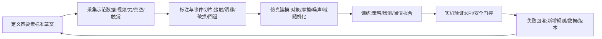
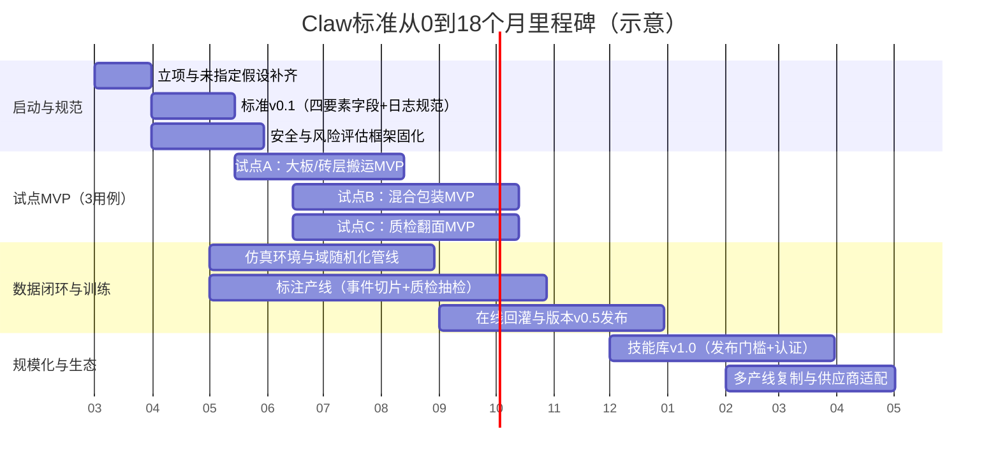

# 在瓷砖制造企业内部定义并落地 Claw 标准的可执行报告

## 执行摘要
本报告提出一套可落地的方法，在瓷砖/建材制造企业内部把工人“手感”转换为可复用、可迭代、可对外适配的 **Claw 标准**（操作接口/动作语言）。核心做法是：以 **Object/Contact/Motion/Feedback** 四要素为“动作API”，通过传感器与视频标注采集老师傅示范数据，建立操作本体与数据闭环，在仿真—现实中训练与验证，并以版本治理、IP归属与安全合规为护栏，18个月内形成可复制的“技能库+标准文档+可量产工位”。（日期基准：2026-02-24）citeturn0search2turn0search3turn2search3turn3search2turn4search0

## 目标与价值
### 为什么要做
在工业机器人领域，已有标准对“机器人本体安全/系统集成安全”“末端执行器安全设计”“夹持器/自动换枪的术语与特性表示”“机器人—工具机械接口”进行了规范化，但这些标准主要覆盖 **安全、接口几何、术语、特性**，并不替代企业内部对“如何抓、抓哪里、用多大力、失败如何回退”的 **现场操作语义**沉淀。citeturn0search1turn2search3turn3search4turn4search0turn4search8  
因此，Claw 标准的目标不是“造爪子”，而是把老师傅的隐性知识转成可版本化的“动作语言”，使后续任何机器人/夹具/算法供应商都能按同一语义实现，降低集成不确定性与重复研发。citeturn0search2turn2search5turn4search2turn4search1turn4search8

### 商业与战略收益
**直接收益（可量化）**：把依赖熟练工的关键操作环节变成可复制的“技能工位”，优先聚焦高人工成本、高碎损/返工成本、夜班稳定性差的工序；通过标准化反馈判定（如真空压力/滑移/边角破损）减少“靠经验试”的停线与调机时间。citeturn1search3turn1search8turn1search20turn3search0turn3search2  
**结构性收益（护城河）**：形成企业自有的 **操作本体+数据资产+技能版本库**，未来无论选用何种机器人本体、控制器或夹具结构，都能以标准快速适配；同时具备对外输出“行业操作规范/工位包”的潜力（类似软件的SDK/认证生态）。citeturn2search5turn4search8turn6search2turn6search19turn6search0  
**安全与合规收益（硬约束）**：把接触力/速度/危险能量等约束前置写入 Contact 与 Feedback，结合风险评估与机器人安全标准，减少后期验收与整改风险。citeturn2search3turn3search2turn3search4turn3search17turn0search12

### 未指定假设
| 项目 | 未指定假设 | 对方案影响 | 建议在立项两周内补齐的数据 |
|---|---|---|---|
| 现有自动化水平 | 产线/仓储是否已有机器人、AGV、视觉工位未知 | 决定“改造难度、接口兼容、数据接入成本” | 现有设备清单、PLC/现场总线、MES/WMS接口 |
| 关键痛点基线 | 碎损率、返工率、人工工时、瓶颈工序未给出 | 决定试点ROI与KPI阈值 | 近12个月OEE、碎损/客诉、夜班波动 |
| 预算范围 | CAPEX/OPEX与人力编制未给出 | 决定“买现成 vs 自研比例” | 单工位投资上限、年度研发预算、人力可调配 |
| 数据合规边界 | 车间视频采集与员工数据授权规则未知 | 决定“采集方式与匿名化策略” | 安环/法务合规意见、员工沟通机制 |
citeturn2search3turn3search2turn3search17turn4search0turn5search0

## Claw 标准体系与模板
本节给出可复制的“Claw 标准”结构：**总规范 + 四要素规范（Object/Contact/Motion/Feedback）+ 三个试点用例的落地样例**。其设计原则是可被不同供应商实现、可在仿真与现实中闭环训练，并能纳入安全标准的风险评估流程。citeturn4search8turn4search0turn3search2turn0search2turn0search3

### Claw 总规范模板
**模板 A：ClawSkillSpec（技能规范头部）**（建议用文档+机器可读YAML/JSON双份发布；版本按语义化版本管理）citeturn6search2turn4search8turn4search2turn3search2turn4search0

```yaml
skill_id: "TILE-HANDLE-LAYER-PICKPLACE"
skill_name: "瓷砖层抓取-搬运-码放"
skill_version: "0.3.0"   # 建议采用 SemVer：破坏性改动->MAJOR；字段新增->MINOR；阈值微调->PATCH
scene_scope:
  line: "包装前缓存区->码垛位"
  shift: "白班/夜班"
  environment: "粉尘;反光;可有水膜"
safety_baseline:
  risk_assessment_standard: ["GB/T 15706", "GB 11291.1", "GB 11291.2"]
  eoat_safety_guidance: ["GB/Z 43065.1"]   # 末端执行器安全设计指南
mechanical_interface:
  flange_standard: "ISO 9409-1"
  toolchanger: "optional"  # 若需自动换爪，引用内部ToolChangeSpec
signals:
  required_sensors: ["RGBD", "vacuum_pressure", "ft_6axis(optional)", "edge_camera(optional)"]
  logging_rate_hz: 100
acceptance_kpi:
  grasp_success_rate: ">= 99.5%"
  damage_rate: "<= 0.05%"
  cycle_time_sec: "<= baseline*0.8"
```

> 说明：ISO 9409-1 的目标是保证末端执行器与机器人之间机械接口的交换性与安装方向一致性，适合作为“物理层接口基线”；其上再叠加企业自定义的“动作语义”。citeturn4search8turn4search23turn4search4

### 四大标准要素字段与示例模板
下表把四要素拆成“字段—类型—示例—采集来源”。你可以把它直接变成企业内部标准（Excel/数据字典/JSON Schema）。citeturn4search2turn4search0turn1search2turn1search8turn0search12

**模板 B：Object 标准字段表（对象语义）**

| 字段 | 类型 | 示例 | 采集/来源 |
|---|---|---|---|
| object_class | 枚举 | tile_slab / carton / pallet / spacer | 工艺/物料主数据 |
| sku_id / batch_id | 字符串 | SKU-800x800-MATTE | ERP/MES |
| geometry | 结构体 | {L,W,T,flatness} | 三维测量/来料规格 |
| mass_range | 区间 | 12–18 kg | 称重台/标称 |
| fragility_level | 等级 | F3（边角敏感） | 质检/碎损统计 |
| surface_property | 结构体 | {roughness, coating, wet} | 视觉+工艺条件 |
| allowable_contact_zones | 多边形集合 | 面A可吸附；四边5mm禁区 | 工艺定义+实验验证 |
| pose_tolerance | 结构体 | {pos_mm, yaw_deg} | 工位标定 |
| contamination | 枚举 | dust / water_film / none | 现场巡检 |

**模板 C：Contact 标准字段表（接触语义）**

| 字段 | 类型 | 示例 | 采集/来源 |
|---|---|---|---|
| contact_mode | 枚举 | suction_area / suction_cup / parallel_jaw / soft_pad | EOAT方案 |
| seal_material | 枚举 | foam / silicone | 夹具设计；铺垫材料 |
| max_normal_force_N | 数值 | 80N（面接触等效） | F/T或推算 |
| max_edge_pressure | 区间 | 禁止直接压边 | 工艺规则 |
| vacuum_pressure_kPa | 区间 | -60 ~ -80kPa | 真空压力传感器 |
| slip_detection | 规则 | marker_motion>thr → slip | 触觉/视觉滑移检测citeturn1search8turn1search20 |
| contact_precheck | 条件 | 平整度/粉尘>阈值 → 先吹扫 | 视觉/粉尘策略 |

**模板 D：Motion 标准字段表（动作语法）**

| 字段 | 类型 | 示例 |
|---|---|---|
| primitive_set | 列表 | Locate→Approach→Engage→Lift→Transfer→Place→Release |
| parameter_bounds | 结构体 | {approach_speed, lift_acc, rotate_deg} |
| state_machine | 图/表 | 正常流程 + 失败回退（Retry/Abort） |
| planner_type | 枚举 | rule_based / BT / TAMP / learned_policy |
| collision_model | 引用 | 工位几何 + 安全距离 |
| timing_constraints | 结构体 | {max_cycle_time, dwell_time} |

> 行为树（BT）常用于把复杂任务拆成可复用模块，并天然支持“Running/Success/Failure”三态返回，非常贴合“动作语言+反馈门控”的工程实现。citeturn6search1turn6search5

**模板 E：Feedback 标准字段表（判定与学习信号）**

| 字段 | 类型 | 示例 |
|---|---|---|
| success_criteria | 逻辑表达式 | vacuum_ok AND pose_ok AND no_edge_chip |
| sensors | 列表 | RGBD, vacuum, encoder, (optional) 6-axis F/T, tactile |
| thresholds | 字典 | vacuum_drop<ΔkPa; slip_prob<0.1 |
| anomaly_codes | 枚举 | VAC_LEAK / SLIP / EDGE_HIT / VISION_LOST |
| log_schema | 结构体 | 时间戳对齐、采样率、坐标系定义 |
| reward_signal | 数值/函数 | 成功+1；破损-5；超时-0.2 |

> 六轴力/力矩传感器可测量三向力与三向力矩（Fx,Fy,Fz,Tx,Ty,Tz），适合用于接触阶段的闭环控制与异常检测。citeturn1search2turn1search34turn1search6

### 三个试点用例与操作本体样例
下面给出三类在瓷砖企业中常见、且具有“手感壁垒”的试点：大板搬运、混合包装、质检翻面。每例都提供四要素样例，可直接作为MVP规范草案。citeturn1search3turn3search2turn4search0turn0search2turn5search2

image_group{"layout":"carousel","aspect_ratio":"16:9","query":["vacuum gripper handling ceramic tiles industrial robot","six axis force torque sensor on robot wrist","tactile sensor GelSight on robot gripper"],"num_per_query":1}

**用例一：大板/瓷砖层搬运（真空大面积抓取）**  
- **Object 属性表（样例）**

| 属性 | 示例 |
|---|---|
| object_class | tile_layer |
| 尺寸范围 | 600×600 至 1200×2400（层抓取时为“砖层包络”） |
| 质量范围 | 20–80 kg（取决于层数/规格） |
| 表面状态 | 反光/粉尘/可能水膜 |
| 允许接触区 | 大面可接触；边缘与角部设“禁压线” |

- **Contact 规则（样例）**  
  1) 接触模式：suction_area；密封材料：foam；要求真空压力稳定在目标区间；2) 若视觉检测粉尘/孔洞导致密封风险↑，先执行吹扫/换抓取点；3) 若真空压降超过阈值或检测到滑移，立即降速并进入 Retry。citeturn1search3turn1search31  
- **Motion 序列（样例）**  
  Locate(层中心) → Approach(垂直下压到预接触高度) → EngageVacuum(建立负压并保持dwell) → Lift(低加速度) → Transfer(限速) → Place(对齐托盘定位) → ReleaseVacuum → VerifyClearance  
- **Feedback 判定（样例）**  
  success = vacuum_ok(持续T秒) AND pose_ok(≤±3mm/±1°) AND no_drop_event；  
  failure = VAC_LEAK 或 slip_prob>阈值 或 edge_hit（由力/视觉/声学可选）。citeturn1search3turn1search2turn1search20  

> 参考：真空大面积抓取系统在“瓷砖层搬运”场景中常用，并可通过泡棉作为密封元素实现“轻柔无损”接触。citeturn1search3turn1search31

**用例二：混合包装（多SKU拣选+装箱）**  
- **Object 属性表（样例）**

| 属性 | 示例 |
|---|---|
| object_class | tile_carton / spacer / label |
| 变化性 | SKU多、箱型多、摆放随机 |
| 关键风险 | 抓错SKU、漏装、箱体破损、节拍波动 |

- **Contact 规则（样例）**  
  1) 对纸箱：suction_cup 或 平行夹（并规定“压痕上限”）；2) 对瓷砖单片：软垫夹持或吸附；3) 设定“抓错/漏装”的反馈信号：重量复核+视觉OCR/条码复核（若系统具备）。  
- **Motion 序列（样例）**  
  Identify(order) → Pick(item_i) → Verify(item_i) → PlaceToBox(slot_i) → UpdateCount → Repeat → FinalWeighCheck → Seal/Label  
- **Feedback 判定（样例）**  
  success = 订单物料清单匹配 AND 重量在允许区间 AND 箱内占位无碰撞；  
  failure = SKU_MISMATCH / COUNT_MISMATCH / BOX_DEFORM。  

> 方法论支撑：复杂装箱更接近“任务-运动规划（TAMP）”问题：高层是订单/装箱策略，底层是避碰与抓放轨迹；把动作拆成 primitives 并以反馈门控，有利于工程实现与后续学习优化。citeturn6search0turn6search19

**用例三：质检翻面（控制姿态、降低视觉不确定性）**  
- **Object 属性表（样例）**

| 属性 | 示例 |
|---|---|
| object_class | tile_single |
| 任务目标 | 翻转/旋转到标准姿态用于检测（正面/背面/角部） |
| 关键风险 | 边角磕碰、滑移、碎裂、姿态不一致导致误检 |

- **Contact 规则（样例）**  
  1) 双吸盘/双区吸附（正反切换）或“吸+托”结构；2) 翻面时限制角速度/角加速度；3) 通过滑移检测（触觉/视觉）与力矩异常（F/T）做早停。citeturn1search8turn1search2turn1search34  
- **Motion 序列（样例）**  
  Pick(front) → Lift → Rotate(180° around safe axis) → Place(back on fixture) → Regrasp(back) → PresentToCamera(标准距离/角度) → Inspect → PlaceToNext  
- **Feedback 判定（样例）**  
  success = 姿态达标 AND 检测图像质量达标（清晰度/反光控制） AND 无边角缺陷新增；  
  failure = SLIP / EDGE_HIT / POSE_OUT。  

> 触觉与滑移检测：光学触觉（如 GelSight 系列）可通过弹性体标记点位移推断剪切/滑移并识别“将要滑”的状态，适合在翻面、旋转等接触丰富动作中作为反馈信号。citeturn1search8turn1search20turn1search16

## 手感采集与操作本体建模
把“手感”转化为资产，关键在于：**把老师傅做事时的状态—动作—反馈链条记录下来，并用一致的本体（ontology）表达**。这与“示教学习/模仿学习（Learning from Demonstration, LfD）”的核心思想一致：从示范数据中学习策略或提炼规则，但企业落地更强调可审计、可回放与可验收。citeturn0search2turn0search22turn6search0turn1search2turn5search0

### 采集方法总览模板
**模板 F：手感采集方案选择表**

| 方法 | 记录内容 | 优点 | 风险/成本 | 适用动作 |
|---|---|---|---|---|
| 多机位视频（顶视+侧视+近景） | 手部轨迹、接触时刻、失败模式 | 成本低、可回放、易启动 | 反光粉尘影响；标注工作量大 | 搬运、翻面、装箱 |
| 腕部六轴F/T（在夹具或工具与机械臂之间） | 接触力/力矩，碰撞与摩擦变化 | 捕捉“用力大小”“卡住” | 需要标定与数据对齐 | 接触丰富动作、边角敏感 |
| 真空压力/流量传感 | 密封质量、泄漏、吸附稳定性 | 与吸附成功强相关 | 对粉尘/孔洞敏感 | 真空抓取 |
| 触觉（BioTac/GelSight等） | 剪切/滑移、微振动、接触形变 | 直接刻画“滑/稳” | 成本高、耐久与维护 | 翻面、旋转、抓取不确定物 |
| 示教/牵引（kinesthetic teaching） | 轨迹+关键点（可同步力） | 直接得到“期望动作” | 需停机/安全防护 | 新工位开发阶段 |

> 触觉传感例：BioTac 提供接触力、微振动与热通量等多模态信息；GelSight 可估计剪切/滑移并用于滑移检测。citeturn1search13turn1search8turn1search20turn1search1turn0search22  
> 六轴F/T例：六轴力/力矩传感器用于测量三维力与三维力矩，是典型的人机接触/装配/抓取反馈传感器形态。citeturn1search2turn1search34turn1search6

### “老师傅手感”结构化流程
建议把采集与建模按“三层抽象”推进：**现象层（视频/传感器）→ 事件层（接触/滑移/碰撞事件）→ 语义层（Object/Contact/Motion/Feedback）**。citeturn0search2turn6search1turn5search0turn5search1turn2search3

**模板 G：事件标注规范（片段级）**（可在 CVAT/Label Studio 中实现）citeturn5search0turn5search1

| 字段 | 说明 | 示例 |
|---|---|---|
| clip_id | 视频片段ID | CAM3_2026-03-05_0012 |
| object_id | 关联对象 | tile_slab_batchA_07 |
| event_type | 事件类型 | contact_start / vacuum_ok / slip / edge_hit / release |
| t_start/t_end | 时间戳 | 12.034s–12.410s |
| severity | 强度/等级 | slip_sev=2 |
| cause_hypothesis | 可能原因 | 粉尘导致密封不良 |
| operator_action | 人的补救动作 | 轻抖/重新找位 |

> 工具参考：CVAT 与 Label Studio 都属于通用数据标注平台，可用于图像/视频等数据标注，并支持导出用于训练的结构化标签。citeturn5search0turn5search14turn5search22

### 操作本体建模模板
操作本体的目标是“让不同场景共用同一套词表”，避免每个项目都发明一套叫法。你可以把它看成企业级“动作字典”。citeturn4search2turn4search1turn6search0turn6search19turn2search5

**模板 H：操作本体最小集合（MVP Ontology）**

| 本体层 | 核心类 | 最小字段 |
|---|---|---|
| Object | ObjectClass / SurfaceZone / Pose | geometry, fragility, allowable_contact_zones |
| Contact | ContactMode / Seal / ForceLimit | vacuum_range, normal_force_limit, slip_rule |
| Motion | Primitive / Parameter / Transition | preconditions, effect, param_bounds |
| Feedback | Signal / Threshold / Outcome | success_criteria, anomaly_codes |

> 外部对齐建议：夹持器相关术语与特性可参考国家标准中对“抓握型夹持器物体搬运”词汇与特性表示的做法；自动换爪系统也有对应“词汇与特性表示”标准，可作为内部数据字典的对齐基线。citeturn4search2turn4search1

## 数据与训练闭环
Claw 标准要变成“可用”，必须形成 **仿真→现实→再训练** 的闭环：仿真用于快速迭代与覆盖长尾；现实用于校准摩擦、粉尘、反光、材料差异等“现实鸿沟”；再训练把失败案例固化为新版本标准与模型。citeturn0search3turn0search7turn5search2turn6search3turn1search3

### 闭环流程图


> 域随机化可通过在仿真中随机化外观或物理参数来提升从仿真到现实的迁移能力，是缓解“现实鸿沟”的经典方法之一。citeturn0search3turn0search7turn5search2  
> 机器人仿真平台示例：NVIDIA Isaac Sim 用于在物理逼真的虚拟环境中开发、仿真和测试AI驱动机器人；MuJoCo 是面向接触动力学的通用物理引擎。citeturn5search8turn5search6turn5search3

### 标注规范与数据结构模板
为了让数据能跨团队/跨供应商复用，建议定义统一的“时序日志+标注事件”格式（即使不用ROS，也要采用同等严格的时间戳、坐标系、采样率约定）。citeturn2search5turn1search34turn4search8turn3search2turn5search10

**模板 I：时序日志字段（建议）**

| 字段 | 说明 |
|---|---|
| t | 统一时间戳（PTP/NTP校准策略需定义） |
| frame_id | 坐标系（base/tool/camera） |
| pose | 末端位姿（位置+四元数） |
| wrench | 6轴力/力矩（可选） |
| vacuum | 真空压力/流量 |
| tactile | 触觉特征（如滑移概率、剪切估计） |
| vision | 目标检测/分割/6D位姿/质量分数 |
| state | Motion状态机状态 |
| outcome | success/failure + anomaly_code |

### 训练指标与在线学习策略
**模板 J：训练/验证指标表**（将其纳入“技能版本发布门槛”）

| 指标 | 定义 | 目标（示例） | 备注 |
|---|---|---|---|
| grasp_success_rate | 抓取成功/总尝试 | ≥99.5% | 分SKU/班次统计 |
| damage_rate | 破损/总处理 | ≤0.05% | 必须与质检口径一致 |
| cycle_time | 单循环时间 | ≤人工基线×0.8 | 注意节拍波动 |
| recovery_rate | 失败后自恢复成功率 | ≥90% | 体现“韧性” |
| safety_events | 急停/碰撞/越界 | 0 | 强制门槛 |

训练方法上，可以组合：  
- **抓取策略/抓取点**： Dex-Net 系列展示了利用大量合成数据训练抓取质量模型（平行夹抓取与吸盘抓取均有对应版本），适合“先用仿真扩大覆盖、再用实机校准”的路线。citeturn6search3turn6search14turn6search18  
- **接触阶段控制**：用F/T与触觉信号做异常检测与闭环调节，尤其对“边角敏感、滑移风险高”的动作更关键。citeturn1search2turn1search8turn1search20turn1search34  
- **在线学习/持续改进**：把失败样本优先回灌（active learning思想），通过版本迭代把“人的补救动作”固化为新的 Motion 回退分支与 Feedback 判定。citeturn5search22turn0search22turn6search1

## 技术栈与供应链
Claw 标准落地需要“工位级”（硬件+控制+感知+数据）的一整套技术栈。此处给出可执行的参考架构与供应链适配要求，确保你不是在做一次性项目，而是在搭建可复用平台。citeturn4search8turn3search2turn2search5turn5search2turn2search8

### 参考架构模板
**模板 K：工位技术栈分层表**

| 层级 | 组件 | 推荐选项 | 输出/接口 |
|---|---|---|---|
| 物理层 | 机器人本体+EOAT | 工业六轴/协作臂；真空/夹持/软垫 | ISO 9409-1法兰；I/O/总线citeturn4search8turn4search23 |
| 传感层 | 视觉/力觉/真空/触觉 | RGBD；6轴F/T；压力/流量；触觉 | 时间戳对齐日志citeturn1search2turn1search8turn1search3 |
| 控制层 | 运动规划与执行 | MoveIt/自研轨迹；BT/状态机 | 动作原语APIciteturn2search2turn6search1turn6search5 |
| 数据层 | 采集/标注/训练 | CVAT/Label Studio；仿真 Isaac Sim/MuJoCo | 数据字典与版本库citeturn5search0turn5search1turn5search8turn5search6 |
| 集成层 | OT/IT互联 | OPC UA/现场总线/PLC | 工位状态上报与指令下发citeturn2search8turn2search24 |

> 工业互联建议：OPC UA 是面向工业系统安全数据交换的、平台无关的互操作标准，由 OPC Foundation 推动，并被 IEC 62541 采纳，有利于在工位与MES/WMS之间建立可维护的数据接口。citeturn2search8turn2search24turn2search0

### 机器人厂商适配要求模板
**模板 L：对机器人/集成商的“Claw 标准适配清单”**（写进采购与验收条款）

| 类别 | 必须项 | 验收方式 |
|---|---|---|
| 机械接口 | 法兰符合 ISO 9409-1；工具定位销/防过约束建议 | 量具+装配复现测试citeturn4search8turn4search23 |
| 安全合规 | 满足 GB 11291.1/11291.2 的系统安全与集成要求；EOAT遵循末端执行器安全设计指南 | 风险评估文档+第三方/内部安环评审citeturn3search17turn3search4turn4search0 |
| 传感/数据 | 提供可访问的实时I/O、力/位姿/报警；支持日志导出 | 对齐采样率测试与断点恢复演练 |
| 控制接口 | 支持外部触发原语、急停与安全门控 | 工位联调与失效模式测试 |
| 维护性 | 备件周期、远程诊断、软件更新策略 | SLA与MTTR指标 |

### 优先合作的外部资源与参考来源
为降低试错成本，建议优先对齐以下“权威来源/原始论文/标准体系/开源框架/行业应用案例”。（中文来源优先，且以官方/标准平台为先。）citeturn3search2turn4search2turn2search8turn6search3turn5search8

| 类别 | 推荐资源 | 为什么优先 |
|---|---|---|
| 国家/国际标准（中文可获取元数据） | 全国标准信息公共服务平台（GB 11291、GB/T 15706、GB/Z 43065.1、GB/T 19400等）citeturn3search2turn3search17turn4search0turn4search2 | 便于合规与验收；能把安全与术语对齐到国家标准体系 |
| 机械接口标准 | ISO 9409-1citeturn4search8turn4search23 | 末端执行器物理层可交换性基线 |
| 机器人安全体系 | ISO 10218 / ISO 12100；以及国内等同采用/对应标准citeturn0search1turn2search3turn3search4turn3search2 | 把风险评估流程固化进标准落地 |
| 工业开源软件 | entity["organization","ROS-Industrial","open-source robotics manufacturing"]citeturn2search5turn2search13、MoveIt 2citeturn2search2turn2search10 | 复用工业机器人软件生态与质量规范，降低底层集成成本 |
| 数据标注平台 | CVATciteturn5search4turn5search0、Label Studiociteturn5search1turn5search14 | 快速建立标注产线与规范，支持多模态标注 |
| 仿真平台 | entity["company","NVIDIA","gpu computing company"] Isaac Simciteturn5search8turn5search5；MuJoCociteturn5search6turn5search3 | 支持仿真训练与合成数据；可加速迭代 |
| 学术基线 | LfD 综述（Argall 2009）citeturn0search2turn0search30；域随机化（Tobin 2017）citeturn0search3；Dex-Net 抓取（Mahler 2017）citeturn6search3turn6search14 | 给出可引用的方法论与评估框架，避免“闭门造车” |
| 行业应用案例 | entity["company","Schmalz","vacuum handling manufacturer"] 对瓷砖层真空搬运的公开案例citeturn1search3turn1search31 | 直接对照瓷砖无损搬运的工程要点（泡棉密封、层搬运等） |

> 企业背景引用（用于组织与资源规划）：entity["company","佛山欧神诺陶瓷有限公司","ceramics maker foshan"] 作为高端瓷砖制造企业的公开介绍显示其在多地拥有生产基地与制造能力，这意味着“试点选线、复制扩散”具备组织基础，但也要求标准治理与版本控制更严格。citeturn7search0turn7search2turn7search1  
> （说明：以上为公开资料引用，用于“多基地复制”的组织假设，不替代内部产线调研。）

## 组织治理、路线图与风险应对
Claw 标准落地不是单点自动化项目，而是“标准+数据+工位+生态”的系统工程：必须在治理层面明确职责、IP、版本与安全红线，并用里程碑驱动。citeturn3search2turn3search17turn4search0turn6search2turn2search8

### 组织与治理模板
**模板 M：RACI（职责矩阵）**

| 工作项 | 业务/工艺 | 自动化/设备 | 算法/数据 | IT/OT | 安环/法务 | 采购 |
|---|---|---|---|---|---|---|
| 场景选择与KPI口径 | R | C | C | C | C | I |
| 四要素标准制定 | A | R | R | C | C | I |
| 数据采集与标注 | C | R | A | C | C | I |
| 仿真与训练 | I | C | A | C | I | I |
| 工位集成与验收 | C | A | R | R | A | R |
| 版本发布与变更 | A | R | R | C | C | I |

**模板 N：IP归属与对外协作条款要点（建议写入合同）**
- 数据（原始视频/传感器/标注）与派生数据（特征、模型权重、阈值表）的所有权归属；  
- 供应商仅获得执行项目所需的有限许可，禁止再利用/转授权；  
- 技能规范文档（ClawSkillSpec）与内部本体词表视为企业核心商业秘密/著作权对象，需明确交付物与可追溯性；  
- 对外接口（如适配SDK/驱动）可采用分层授权策略（内部闭源、外部只开放必要API）。  

> 版本管理建议采用语义化版本：版本号及其变更方式表达兼容性与变更影响，有利于多基地、多供应商协同。citeturn6search2

### 试点场景选择标准与MVP设计模板
**模板 O：试点评分表（建议选Top 3进入MVP）**

| 维度 | 权重 | 评分说明 |
|---|---:|---|
| 价值（节拍/人工/碎损） | 30% | 基线越痛越优先 |
| 可行性（可观测+可控） | 20% | 物体姿态可被约束、反馈信号清晰 |
| 风险（安全/停线） | 20% | 风险可通过标准化门控降低 |
| 可复制性（跨线/跨厂） | 20% | SKU变化与工位相似度 |
| 数据闭环性 | 10% | 失败样本能回灌训练与规则 |

**MVP 设计原则**：  
- 先做“可判定的成功/失败”（Feedback先行），再谈“更聪明的策略”；  
- 优先选择“接触模式单一、对象变化可枚举、回退动作明确”的场景；  
- 每个MVP至少交付：1份技能规范（YAML/文档）、1套采集与标注规范、1个可跑通闭环的工位。citeturn3search2turn4search0turn0search2turn6search1

### 0到18个月里程碑时间线


> 时间线说明：安全与风险评估应贯穿从设计到集成全过程；可参考 ISO/GB 的风险评估方法论与工业机器人安全要求，把“接触限制、异常回退、急停逻辑”写入标准与验收。citeturn2search3turn3search2turn3search17turn3search4turn0search12

### 预算估算模板
在未给定预算上限的情况下，更可执行的做法是先给“科目化预算”，再用选型决定区间。以下为 **MVP期（3个工位）** 的预算框架示例（金额区间需按内部采购价校准）。  

**模板 P：预算科目表（示意，未指定假设）**

| 科目 | 构成 | 说明 |
|---|---|---|
| 工位硬件CAPEX | 机器人本体、EOAT、相机、真空系统、传感器、工装夹具 | EOAT若涉及真空大面积吸附与泡棉密封，需考虑耗材与维护citeturn1search3turn1search31 |
| 集成与调试 | 机械电气集成、PLC/安全、节拍联调 | 需满足GB 11291.1/11291.2、GB/T 5226.1等相关要求citeturn3search17turn3search4turn3search3 |
| 数据与标注OPEX | 采集存储、标注人力、标注平台部署 | 可用CVAT/Label Studio自建citeturn5search4turn5search14 |
| 仿真与训练 | GPU算力、仿真平台、算法人力 | Isaac Sim/MuJoCo + 域随机化citeturn5search8turn5search6turn0search3 |
| 治理与合规 | 风险评估、安环审核、合同/IP | 与标准落地强绑定citeturn3search2turn4search0 |

### 风险与对策模板
**模板 Q：风险登记表（Risk Register）**

| 风险 | 触发信号 | 影响 | 对策（标准层/工程层/组织层） |
|---|---|---|---|
| “只做硬件、不做语义”导致无法复制 | 每条线都要重调参数 | 成本失控 | 强制交付 ClawSkillSpec + 数据字典 + 版本库 |
| 反光/粉尘导致视觉不稳定 | 识别置信度波动 | 抓取失败 | 在 Object/Contact 加入环境字段；用域随机化与现场光学改造citeturn0search3turn1search3 |
| 真空密封不稳定（粉尘/孔洞） | 真空压降、掉砖 | 破损/停线 | Contact中加入预清洁规则；Feedback门控；泡棉密封耗材管理citeturn1search3turn1search31 |
| 接触动作导致边角破损 | 缺角率升高 | 质量事故 | 引入F/T与滑移检测；限制速度/加速度；安全评估前置citeturn1search2turn1search8turn3search2 |
| 数据采集合规与员工抵触 | 采集阻断、投诉 | 项目停滞 | 明确拍摄范围、脱敏与权限；安环/法务+班组沟通机制citeturn3search2turn5search1 |
| 供应商锁定 | 驱动/数据格式封闭 | 生态受限 | 采购条款要求按标准交付日志与接口；以OPC UA/开放协议沉淀互联citeturn2search8turn2search24turn2search5 |

### 下一步行动清单
1) 以“试点评分表”在两周内选定三条最合适的MVP产线/工位，并补齐碎损率、节拍、夜班波动等基线数据（对齐KPI口径）。citeturn3search2turn6search0  
2) 发布企业内部 **ClawSkillSpec v0.1**：四要素字段、日志字段、异常码、验收门槛（同时定义版本策略）。citeturn6search2turn4search2turn4search0  
3) 建立“采集—标注—回放”最小闭环：部署 CVAT 或 Label Studio，完成首批 50–100 个带事件标注的失败/成功片段库。citeturn5search4turn5search14  
4) 选定并搭建试点A（大板/砖层搬运）的硬件原型：优先采用真空大面积吸附+泡棉密封方案，同时把真空压降与掉落事件写入 Feedback 门控。citeturn1search3turn1search31  
5) 将安全与风险评估作为“发布门槛”：按 GB/T 15706 与 GB 11291 系列形成可审计的评估与验收材料，并把安全约束固化到 Contact/Motion/Feedback 字段中。citeturn3search2turn3search17turn3search4turn4search0